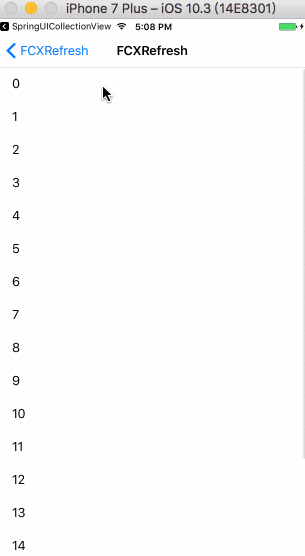

# SwiftFCXRefresh
常用的上下拉刷新功能都支持可自定义，只需简单的两三行代码即可完成，主要支持以下功能：

- 普通上下拉刷新
- 自动上下拉刷新
- 上拉无更多数据控制
- 上下拉百分比显示
- 自定义上下拉动画

## 环境
- Xcode 11+
- Swift 5.2+
- iOS 8.0+

## 如何导入

### CocoaPods

```ruby
pod 'SwiftFCXRefresh'
```
### Carthage

```ogdl
github "FCXPods/SwiftFCXRefresh"
```

### Swift Package Manager
```swift
dependencies: [
    .package(url: "https://github.com/FCXPods/SwiftFCXRefresh", .upToNextMajor(from: "0.1.4"))
]
```

### 手动导入

把Sources下文件导入即可

## 如何使用
包含头文件

```swift
import SwiftFCXRefresh
```
下拉刷新

```swift
headerRefreshView = tableView.addFCXRefreshHeader { [weak self] (refreshHeader) in
    self?.refreshAction()
}
```

自动下拉刷新调用

```swift
headerRefreshView?.autoRefresh()
```

上拉加载更多

```swift
footerRefreshView = tableView.addFCXRefreshAutoFooter { [weak self] (refreshFooter) in
    self?.loadMoreAction()
}
```

自动上拉刷加载更多

```swift
footerRefreshView = tableView.addFCXRefreshAutoFooter { [weak self] (refreshFooter) in
    self?.loadMoreAction()
}
```

上下拉百分比显示

```swift
headerRefreshView?.pullingPercentHandler = { (percent) in
    headerPercentLabel.text = String.init(format: "%.2f%%", percent * 100)
}

footerRefreshView?.pullingPercentHandler = { (percent) in
    footererPercentLabel.text = String.init(format: "%.2f%%", percent * 100)
}
```

上下拉刷新、百分比链式调用

```swift
headerRefreshView = tableView.addFCXRefreshHeader { [weak self] (refreshHeader) in
    self?.refreshAction()
}.pullingPercentHandler(handler: { (percent) in
    //百分比
    print("current percent", percent)
})

footerRefreshView = tableView.addFCXRefreshFooter { [weak self] (refreshFooter) in
    self?.loadMoreAction()
}.pullingPercentHandler { (percent) in
    print("current percent", percent)
}
```

## 显示效果：


